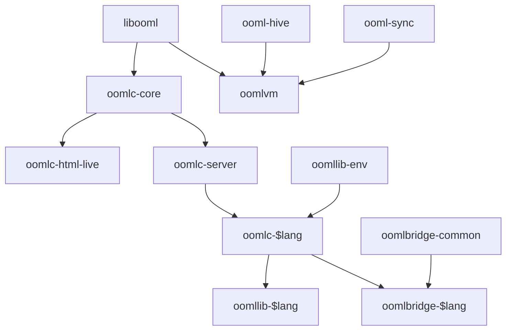

```mermaid
graph TD
libooml-->oomlc-core
libooml-->oomlvm

oomlc-core-->oomlc-html-live

oomlc-core-->oomlc-server

oomlc-server-->oomlc-$lang

ooml-hive-->oomlvm
ooml-sync-->oomlvm

oomllib-env-->oomlc-$lang
oomlc-$lang-->oomllib-$lang

oomlbridge-common-->oomlbridge-$lang
oomlc-$lang-->oomlbridge-$lang
```

# Versioning
