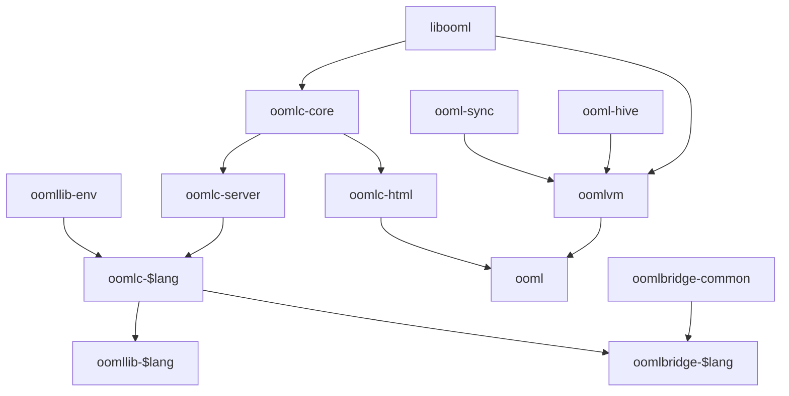

# General process

Assume compiler is oomlc-$lang, where `$lang` is a specific language.

## Project structure

## oomllib

Every language except for HTML, JS, and JS-related ones has their own `org.ooml.oomllib.$lang` (oomllib) library/module/package and subpackages, designed to help with developing for ooml:

|Package|Description|Example|
|---|---|---|
|org.ooml.oomllib.$lang|Various ooml annotations and constants|Annotations for declaring transient properties and getters and setters.|
|org.ooml.oomllib.$lang.ail|Functions and classes for AIL|`EventSource`, `Array`, `Instance`|
|org.ooml.oomllib.$lang.env|Browser API declarations|Declarations of Web API and ECMAScript classes, functions, and constants.|

### org.ooml.oomllib.$lang.env

Compared to the other oomllib packages, `org.ooml.oomllib.$lang.env` does not sync with oomlc-$lang. It is developed and versioned separately. This way, it's possible to use newer (or older) Web and ECMAScript APIs without having to use potentially breaking changes with ooml and other ooml packages.

`org.ooml.oomllib.$lang.env` is versioned using a date rather than semver, to reflect the "living standards" and fast pace of development on the web.

#### Browser compatibility

`org.ooml.oomllib.$lang.env` will always contain the latest APIs and features. However, most of the latest features are not compatible with the most widely-used platforms and versions. To resolve this, oomlc-$lang can compile to a **target**, which will ensure that the compiled code is compatible with the targeted platform and version. This is done mostly with transpilers and polyfills.

This way, it's possible to use most newer features while still remaining compatible with older platforms. This is very similar to writing ESNext code and using Babel + plugins + polyfills to transpile to ES5 code.

## ECMAScript and Web APIs

These are all provided via `org.ooml.oomllib.lang.env`. Most ECMAScript functionalities that are provided by languages (e.g. primitive types, common data structures, standard libraries) are omitted so that language-specific features are used rather than JS ones. This makes it easier and more natural to use the language, and eases interop.

Normal ECMAScript and Web APIs cannot be accessed as "globals", even if the language supports it. For example, it's not possible to simply write `new Image()` in Java or `parseInt()` in Python.

## Language interop

### Syntax

### Core types

### Standard libraries

### Bridging

## Imports

- Bridgable builtin imports
- oomllib
- From sources root
- ooml modules
- Non-ooml imports

## Using packages/libraries/modules

Most languages have a package management system that allows automatic downloading and usage of dependencies. These can be imported into code, which requires the compiler/interpreter to have an import system for finding and loading external libraries/modules/packages. Here are some examples (not comprehensive):

|Language|Package manager|External code|Search mechanism|Relative imports|
|---|---|---|---|---|
|JavaScript|npm|Modules|Find nearest `node_modules`|Yes, using paths starting with `./`|
|Java|maven|Packages|Classpath|No|
|Python|pip|Modules|Import path|Yes, using modules starting with `.`|
|Ruby|RubyGems|Gems|Load path|Yes|

### Developing with other ooml modules

- Other modules should be in development bytecode form.
- An `ooml-module.json` file should exist and specify URLs to dependencies.
- oomlc-$lang reads `ooml-module.json`, downloads dependencies in bytecode form to `__ooml/modules/__bc`, and generates declarations in specific-language to `__ooml/modules/lang`.
- `__ooml/modules/lang` should be added to the search mechanism of the language's import loader to allow generated declaration modules to be referred to in development.

### Using non-ooml dependencies

- Dependencies not written for ooml can be used as a dependency so long as:
  - The source code is available.
  - The source code is written in a supported language (e.g. can't be a native module).
  - The source code is compatible with oomlc-$lang.

### Using JavaScript browser libraries

- JS libraries don't have type declarations and may not be object-orientated, making it hard to use with ooml in other languages.
- It's possible to just use `window.*` and suppress compiler warnings about invalid references.
- However, it's better to generate declarations (e.g. classes, methods, types) ooml.
  - Unfortunately, there's no automatic way for all cases.
- Some libraries have bad behaviour, such as using or manipulating globals, that make it even harder to use.
- ooml modules written in HTML can use implicit globals (e.g. `$`, `marked`) instead of `window.*`, because they don't have to be compiled and therefore skip static checks.

#### TypeScript declarations for JS browser library

- JS browser library makes global
- But needs to be imported in other languages
- So when transforming, rename references to `window.*` if imported (but don't allow direct/global access without importing)

### Using JS Node.js libraries

## Bytecode formats

### Development bytecode

Compiling to development bytecode retains all annotations and type declarations so that developing with it or on it is easier.

### Declarations bytecode

Same as development bytecode but without any source code for functions. Usually source code is unnecessary for dependencies.

### Production bytecode

Generally, all annotations and type declarations are erased for faster performance.

## ooml-module.json

## Transpiled JavaScript

### Shadowing

It's possible access to host objects (`window.*` globals) is shadowed, so can't be directly referred to.

Either create an unique variable in current context aliasing desired host object, or just use `window` and make sure nothing is called `window` (treat like a keyword&mdash;rename or reject).
